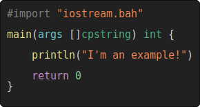

# Bah snippets

Generate a SVG image from a bah file.

Note that this was written in 1 hour, this is not the most beautiful code out there...

> This is used in the readme of the [Bah](https://github.com/ithirzty/bah) repo.

## Example
This is an example from `examples/example.bah`

## Usage
First you will need to compile the program, do: `bah ./main.bah`

This is the most simple command: `./main myFile.bah`

For more help, do: `./main -h`